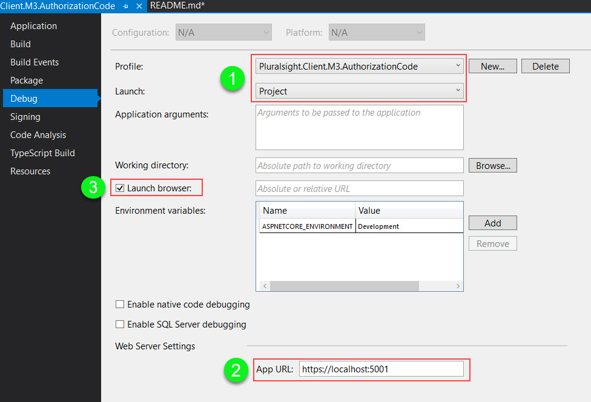
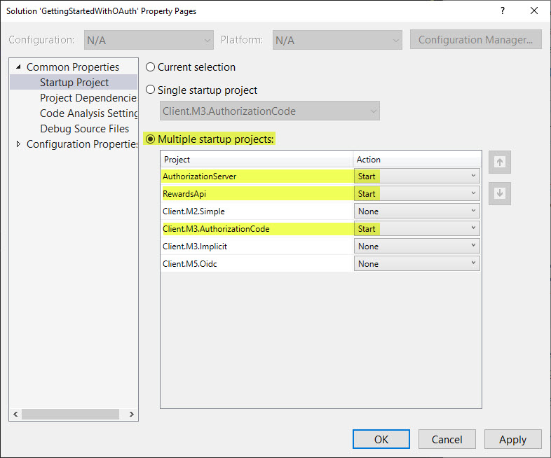
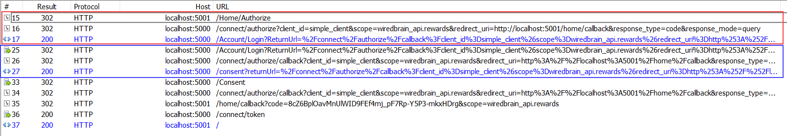

### Execute
Begynd med at konfigurere opstarten af de 3 projekter. Det er nemmerst at gøre ved at vælge Properties på hvert enkelt
projekt og gå ind på fanen Debug.
Der skal laves følgende:
1. Vælg at køre koden som selfhosting (altså ikke IIS Express). Det sker ved under **Profile** vælge projektets navn og under **Launch** at vælge *Project*.
2. Ændre App URL til følgende:
   a. AuthorizationServer: https://localhost:5000
   b. Client.M3.AuthorizationCode: https://localhost:5001
   c. RewardsApi: https://localhost:5002
3. Kun Clienten skal have et flueben ved Launch browser. Hverken Authorizationserver eller RewardsApi bruger en webside.

4. Til sidst vælges *Properties* af Solution og vælg: *Multiple Startup Projects*. Sæt rækkefølgen (Start) til:
- AuthorizationServer
- RewardsApi
- Client.M3.AuthorizationCode

5. Start processen op ved at klikke på den grønne pil (Debug).

6. Log på med følgende credentials:

> Username: scott
> 
> Password: scott

&nbsp;

### Fiddler
Filter sættes således op:
- Filters | Use Filters checked
- Show only the folloving Hosts: localhost:5000; localhost:5001; localhost:5002;
- Hide if URL contains: lib logo css favicon

Husk: Clear Cache.

> Authentication Server: Port 5000
> 
> Client.M?.Application: Port 5001
> 
> RewardsApi: Port 5002

&nbsp;

#### Client.M2.Simple

